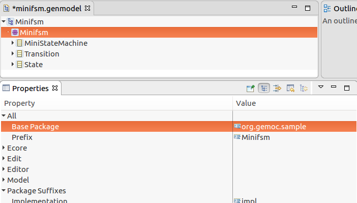
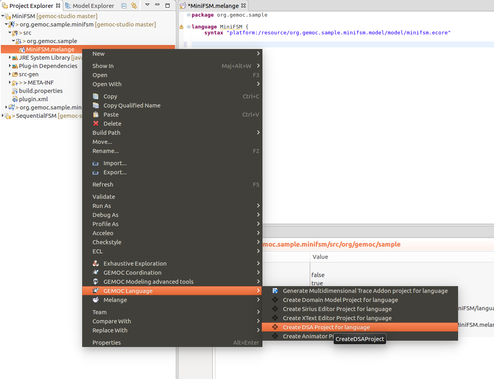
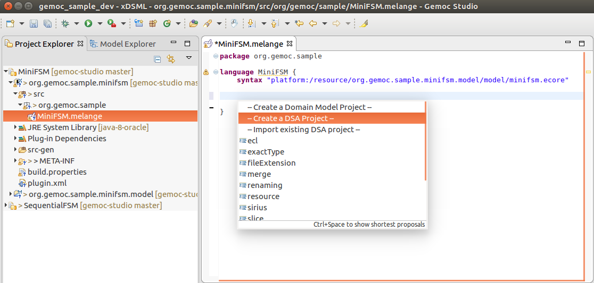
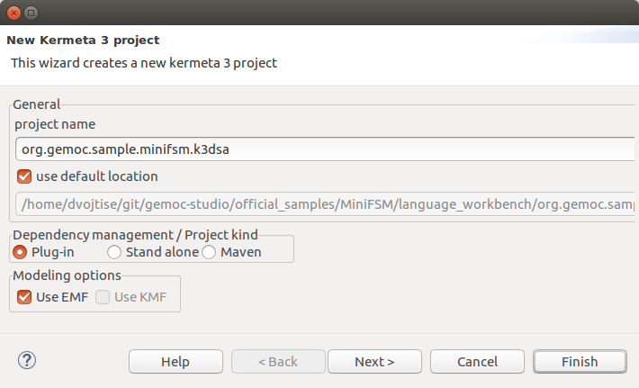
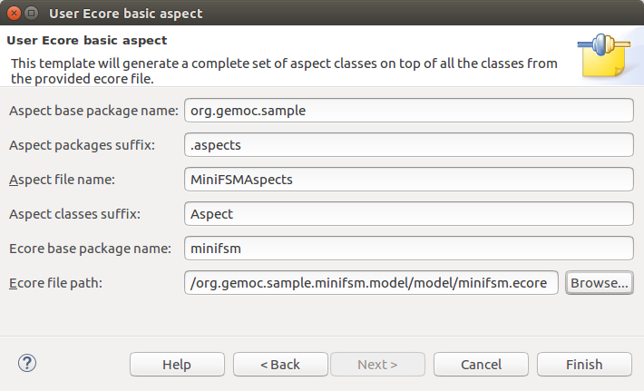

# GEMOC Hello World: Language Engineering with The GEMOC Studio 

* [Scope](#scope)
* [Program](#program)
* [Materials](#materials)

This tutorial provides a practical approach for developing from scratch a Domain-Specific (modeling) Language (DSL). This tutorial leverages the tooling provided by the GEMOC Studio to present the various facilities offered by the Eclipse platform (incl., EMF/Ecore, Sirius) and introduces the advanced features to extend a DSL with a well-defined execution semantics. From such a specification, we demonstrate the ability of the studio to automatically support model execution, graphical animation, omniscient debugging, execution of models.
The  goal of this tutorial is to remain as simple as possible and thus will not cover

## Scope

During this tutorial, the participants will create from scratch a given finite state machine DSL in terms of syntax and semantics using the GEMOC Studio language workbench. The ADL is tailored for designing component-based distributed interactive systems that rely on state-based models to describe component behavior. 
In the modeling workbench, the participants will design models. Based on such a design, participants will be able to execute the modelss according to the execution semantics of FSM, to graphically animate the FSM, and to debug the behavior.

## Legend

* :warning: Read carefully, tricky details follow,
* :bulb: Tip

## Program

:construction: TODO update the outline of this page

- [Part 1. General introduction](#part-1-general-introduction)
- [Part 2. Language engineering](#part-2-language-engineering)
  - [2.1 Create the MiniFSM Language](#2-1-create-the-minifsm-language)
- [Part 3. Model Debugging/animation](#part-3-model-debugging-animation)
- [Part 4. Wrap-up and possible extensions](#part-4-wrap-up-and-possible-extensions)

## Materials

+ Use the latest [GEMOC Studio](http://gemoc.org/studio.html) and with a [Java 1.8 JDK](http://www.oracle.com/technetwork/java/javase/downloads/jdk8-downloads-2133151.html)..

You can refer to the documentation at any time.

## Part 1. General introduction

:construction: TODO

## Part 2. Language engineering

In this part, you will create the metamodel and semantics of a language for finite state machines (FSM). Then you will add behavior to the concepts of the language. After that, you will add new concrete (graphical) syntax to it. The graphical syntax will have 3 layers, one for edition, one for model animation,  and one for model debugging.

### 2.1 Create the MiniFSM Language

- Go to File -> new -> GEMOC Sequential xDSML Language

:construction: TODO

### 2.2 Create the MiniFSM base metamodel (Domain model)

Remove the invalid syntax entry from the melange file

Either, 
- Right click on the Melange file -> GEMOC Language -> Create Domain Model project for language
or,
- Ctrl+space in the melange file to get content proposal -> Create Domain Model project

In the genmodel, change the basePackage to `org.gemoc.sample` in order to have a nicer naming convention for generated classes.

:construction: TODO

### 2.3 Create behavior (K3DSA)

Either, 
- Right click on the Melange file -> GEMOC Language -> Create DSA project for language
or,
- Ctrl+space in the melange file to get content proposal -> Create a DSA project

 

:construction: TODO

#### Playing with the language

1. Start a modeling workbench

   

   ​

2. Get the example for (GEMOC model for FSM Sequential)

   

- Open the *bitshifting.aird* file: there you can see and edit the FSM model.

Next: Run this model. To this effect, open the *run* dialog:

- Run in **debug mode** the **BitShifting.fsm 000101010** run configuration.

You then can play with the debug model by stepping through it and observing the state transitions.

​:warning: You can now close the modeling workbench

### 2.4: Defining concrete syntax with Sirius

In this step, you will define the graphical concrete syntax for a specific modeling element of the MontiArc language using the [Sirius](https://www.eclipse.org/sirius/doc/specifier/diagrams/Diagrams.html) framework. 

:no_entry: For temporal restrictions, we have prepared the state of FSM so far in the folder [2.4-sirius-start](https://github.com/gemoc/ICSA2017Tutorial/tree/master/code/2.4-sirius-start). Please remove your projects from the workspace (or switch to another workspace) and import the projects from this folder.  

As you have added variables, guard, and actions to the metamodel, these should be rendered also. The following figures shows the intended result in action. Transitions display guards and actions, the FSM has a container displaying the current variables values, and the currently touched elements are highlighted during execution.

In *description/XSFSM.odesign* of project *org.gemoc.sample.legacyfsm.xsfsm.design*, you'll find the Sirius designer model that renders the concrete graphical syntax of your language in the modeling workbench. This designer model is connected to you metamodel as depicted below:

This designer model comprises three views: a default view that renders the structural parts of your models, a debug view that overlays the structural parts with information from the debugging process (such as variable values), and an animator view that enables adding domain-specific animations.

- For rendering guards and actions, please adjust the labels of transitions accordingly. To this effect, investigate how the properties of "Event Transition" are mapped to methods of the class `XFSMServices` and adjust the employed methods accordingly.
- For the variables, we want to display their current values. To this end, create a container for variables in the animation view that can contain variables which are represented by labels as depicted by the next three figures.

Please refer to the [Sirius documentation](https://www.eclipse.org/sirius/doc/specifier/diagrams/Diagrams.html) for learning how you can configure in details your editor.

The container for variables with its properties:

The node for variables with its properties:

The label rendering information on variables with its properties:

The label receives its text from the registered services. Depending on the view, the services render either the variables' initial values (default view) or their current values (debugging view). Please have a look at the classes `FSMServices` and `XFSMServices` and investigate how this is achieved.

Let us import an example model from the project [ICSA2017Example](https://github.com/awortmann/xmontiarc/tree/icsa2017tutorial/ICSA2017-FSM-Example) to debug a model with your new representation. In this project, open the file */models/HeatingController.aird* and in the project explorer, open the HeatingController diagram. See below:

From here, you can run the launch configuration */launch/HeatingController.launch*, as a **debug configuration** and start debugging your model. From the variables view (top right), you can adjust the current temperature to observe different FSM behavior. 

:no_entry: The solution of the previous step is available from the [solution folder](https://github.com/gemoc/ICSA2017Tutorial/tree/master/code/solution), if you had any problems with recreating the new syntax elements, please download it, clear your language workbench workspace and import these projects. Then run the modeling workbench on top of these projects.

## Part 3. Model Debugging/animation

#### Testing the execution of the model with its semantics

Create a FSM model with two steps and one transition. Create a variable `a` with `1` as an initial step. Create a guard associated to the transition that checks whether `a == 1`.  Create an action that assigns `2` to the variable `a`.

Let's debug/animate this model!

1. Create the debug configuration

2. You can then debug your language

## Part 4. Wrap-up and possible extensions

